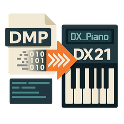

# 🎹 Deflemask to DX21 - FM音色変換ツール

**DeflemaskのFM音源音色データ（YM2612 / YM2151 / YM2203）をYamaha DX21互換のSysEx（VCED形式）に変換するツールです。**
---

## 🔽 ダウンロード

最新版のインストーラは以下からダウンロードできます：

👉 [DmpToDx21 v1.0.0 リリースページ](https://github.com/Hidecade/DmpToDx21/releases/latest)
---

## 🖼 スクリーンショット

---

## 📦 機能概要

- `.dmp` ファイルからFM音色を抽出
- YM2612 / YM2151 / YM2203 に対応
- DX21形式（93バイトVCED）のSysExファイルを出力
---

## 🛠 使用方法（GUI）

1. **DMPファイルを選択**
   - 画面上部の「DMPファイルを選択」ボタンをクリックし、Deflemaskでエクスポートした `.dmp` ファイルを読み込みます。
   - 現在対応しているのは YM2612 / YM2151 / YM2203 のいずれかを使用した楽曲データです。

2. **音色パラメータの確認と編集**
   - 編集可能なのは、**パフォーマンスデータおよび音色データのうち、コントロール上に表示されている項目のみ**です。

3. **MIDI出力またはファイル保存**
   - 編集した音色は、以下のいずれかで出力可能です：
     - **MIDI出力**：MIDI接続されたYamaha DX21へ直接SysEx転送します（MIDIポート設定が必要）。
     - **SysExファイルとして保存**：`.syx` ファイルとして保存し、後でMIDI-OXなどを使用して送信することができます。
---

### 🎛 補足情報

- 音色はすべて**Yamaha DX21互換のVCEDフォーマット（93バイト）**で出力されます。
---

## 💡 注意事項

- 音色の再現度は機種の特性差により100%ではありません
- YM2612固有の機能（DAC、LFOなど）は未対応
- 現在は1音色ずつの変換に対応
---

## 📁 対応ファイル形式

| 入力形式 | 出力形式 |
|----------|----------|
| `.dmp`（Deflemask音色ファイル） | `.syx`（DX21 SysExファイル） |
---

## 🖥 動作環境

- Windows 10 / 11
- [.NET Desktop Runtime 8.0.16（Windows x64）](https://dotnet.microsoft.com/ja-jp/download/dotnet/thank-you/runtime-desktop-8.0.16-windows-x64-installer?cid=getdotnetcore) のインストールが必要
---

## 📜 ライセンス

本ソフトウェアは [MIT License](LICENSE) のもとで公開されています。  
無保証で提供されており、使用は自己責任でお願いします。  
詳細についてはリポジトリ内の `LICENSE` ファイルをご確認ください。
---

## ✉️ 作者

Hideki Konishi  
GitHub: [https://github.com/Hidecade](https://github.com/Hidecade)  
